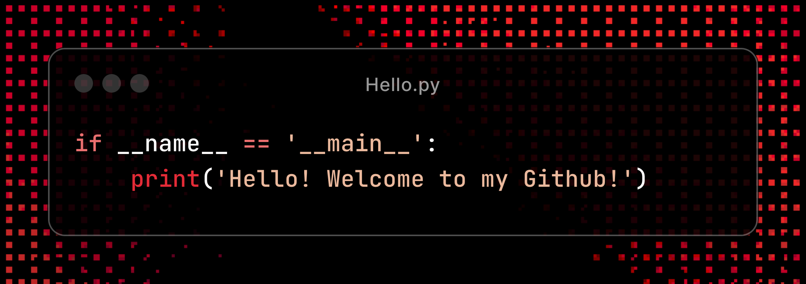

<!-- in your header -->
<link rel="stylesheet" href="https://cdn.jsdelivr.net/gh/devicons/devicon@latest/devicon.min.css">

<h1 align="center">Hi, I'm Ethan </h1>

 

  Visitor count
   
  

 

## About me

- 💻 Software Engineer @ Untitled Cloud Video Company

- 🎓 New graduate from the University of Washington

- 🧬 Bioengineering Researcher @ Stanford

- 📚 Currently learning Kotlin

 

<h3>Languages:</h3>
<code></code>
<code></code>
<code></code>
<code></code>
<code></code>
<code></code>
<code></code>
<code></code>
<code></code>
<code><i style="font-size: 40px;" class="devicon-rust-original"></i></code>

<h3>Frameworks:</h3>
<code></code>
<code></code>
<code></code>
<code></code>
<code></code>
<code></code>
<code></code>
<code></code>
<code></code>
<code></code>

<h3>Platforms/Tools:</h3>
<code></code>
<code></code>
<code></code>
<code></code>
<code><i style="font-size: 40px;" class="devicon-vercel-original"></i></code>
<code></code>
<code></code>
<code></code>
<code></code>
<code></code>

<h3>OS/Editors (I use arch and <a href="https://github.com/justyeethan/AnyaVim" target="_blank" rel="noopener noreferrer">Neovim</a>, btw):</h3>
<code></code>
<code></code>

## :trophy: Git profile Trophies

  

---

Last Edited on: 06/09/2024
